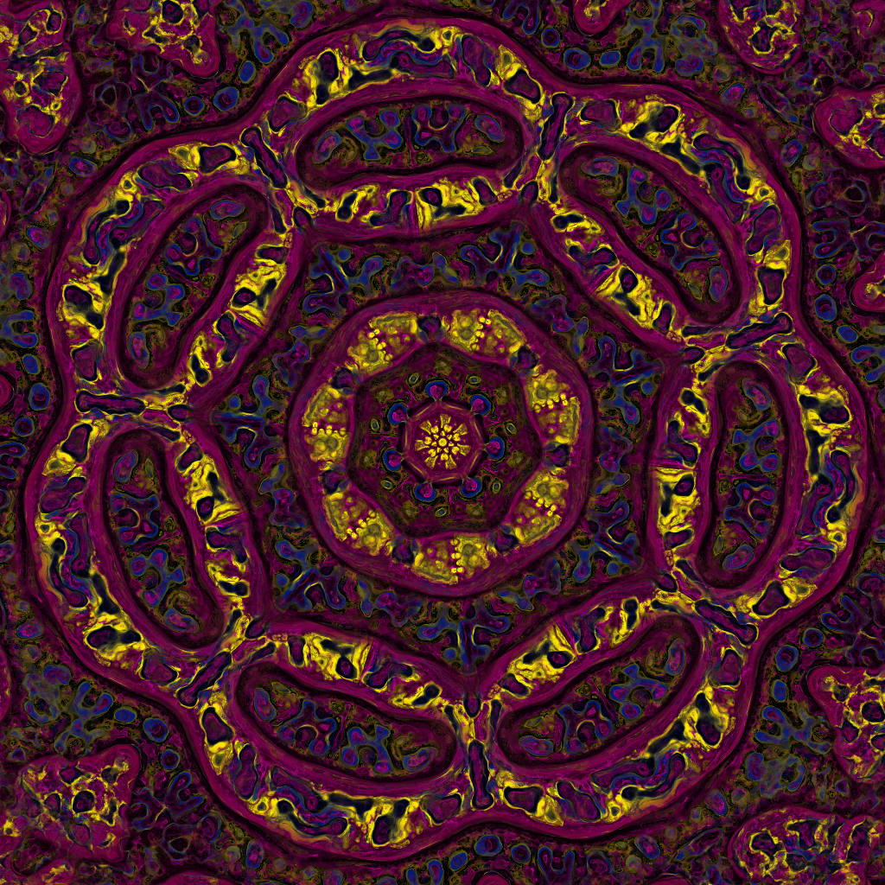

# Multiscale Turing Patterns

Based on:
- [Ricky Reusser's work](http://rreusser.github.io/multiscale-turing-pattern-gallery/)
- [Jason Rampe's work](https://softologyblog.wordpress.com/2011/07/05/multi-scale-turing-patterns/)
- [Jonathan McCabe's paper](http://www.jonathanmccabe.com/Cyclic_Symmetric_Multi-Scale_Turing_Patterns.pdf)

## Zoom

Longer HD video - https://vimeo.com/373669214

## Fast diffusion

The diffusion step requires averaging concentrations over relatively large areas (few hundreds of pixels) which gets really slow on GPUs for larger resolutions, even when separating blur filters x and y directions. One way to optimize this is to use FFT, the other (thanks Oskar!) is to approximate blur/diffusion of different sizes by using mipmaps (details in [this paper](https://cgg.mff.cuni.cz/~oskar/projects/CGA2013/Elek2013.pdf)). This gets us from ~0.66 secs/iteration for 2048x2048 resolution and 3-fold symmetry to ~0.025s/iteration, for some loss in quality. 

## Controls

- F1 - show/hide UI
- F2 - randomize parameters
- F3 - randomize colors
- F4 - pause/resume
- F5 - start recording (images are stored inside timestamp directory inside CWD)
- F8 - take a single screenshot

# Build Instructions

**Requirements:**
* Visual Studio (preferably 2019 or 2017)
  
**Steps**
1. Clone [Builder repo](https://github.com/janivanecky/builder)
2. Make sure that path in `build.bat` inside Builder repo points to existing `vcvarsall.bat` (depends on your VS installation version)
3. Run `build.bat`
4. Optionally run `setup.bat` to setup PATH - you'll be able to run builder just by using `build` command
5. Clone [cpplib repo](https://github.com/janivanecky/cpplib)
6. Clone this repo
7. Run `build run turing2d.build` - if you didn't setup PATH in step 4, you'll have to use `YOUR_BUILDER_REPO_PATH/bin/build.exe` instead

If there are any problems you encounter while building the project, let me know.